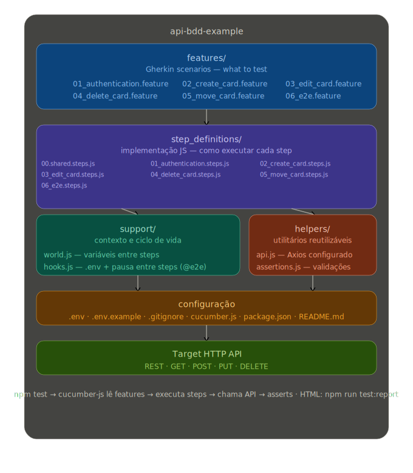

# Exemplo de BDD para API

Pequeno projeto em **Cucumber.js** + **Axios** para verificações de caixa-preta em uma API HTTP que usa autenticação na query string e recursos escopados por board.

Este repositório mantém nomes e documentação propositalmente genéricos. Aponte `API_BASE_URL` e as credenciais no `.env` para o host REST que você usar nas suas execuções.

## Arquitetura



## Pré-requisitos

- Node.js (compatível com as dependências do `package.json`)
- Credenciais da API e IDs de recursos configurados no `.env` (veja `.env.example`)

## Configuração

```bash
npm install
```

Copie `.env.example` para `.env` e preencha com valores reais.

Se você já usou nomes antigos de variáveis em um fork privado, renomeie-as para bater com o `.env.example` (`API_BASE_URL`, `API_KEY`, `API_TOKEN`, `BOARD_ID`, …).

## Executar os testes

```bash
# Suite completa do Cucumber (o perfil padrão exclui @template)
npm test

# Apenas cenários de autenticação (@auth)
npm run test:auth

# Apenas o cenário de desafio end-to-end (@e2e)
npm run test:e2e

# Verificação rápida do .env e GETs de exemplo (curl)
npm run test:env

# Limpar o board no Trello: remove todos os cards do BOARD_ID (use só em board de teste)
npm run cleanup:trello
```

## Limpar dados de teste no Trello

Se a automação deixou muitos cards no board configurado no `.env`, você pode remover **todos** os cards desse board (abertos e arquivados):

```bash
npm run cleanup:trello
```

**Atenção:** o script usa `BOARD_ID` do `.env` e apaga todos os cards retornados pela API do Trello para esse board. Use apenas em um **board dedicado a testes**.

